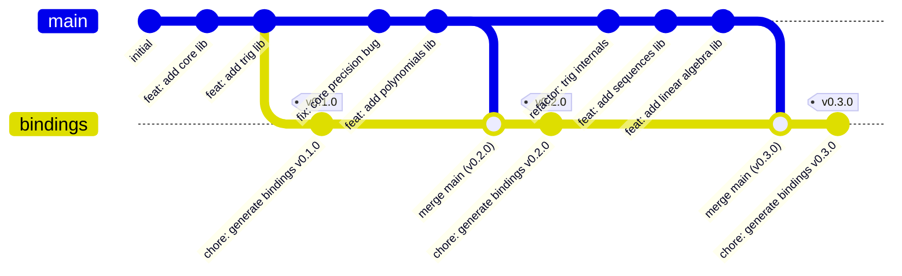
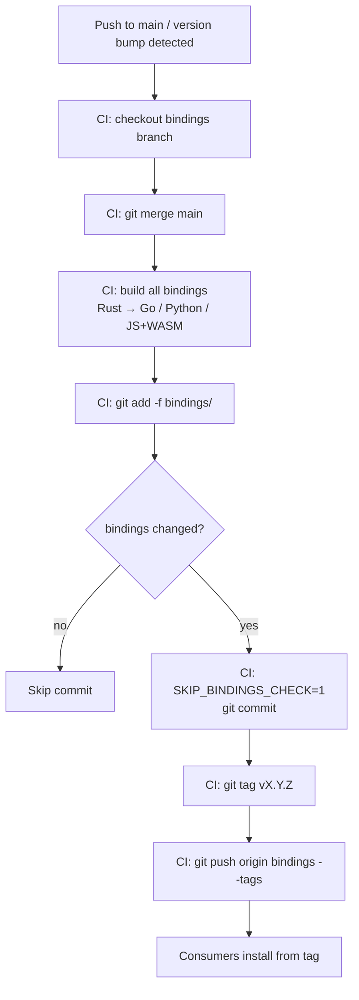

```mermaid
gitGraph
  commit id: "initial"
  commit id: "feat: add core lib"
  commit id: "feat: add trig lib"

  branch bindings
  checkout bindings
  commit id: "chore: generate bindings v0.1.0" tag: "v0.1.0"

  checkout main
  commit id: "fix: core precision bug"
  commit id: "feat: add polynomials lib"

  checkout bindings
  merge main id: "merge main (v0.2.0)"
  commit id: "chore: generate bindings v0.2.0" tag: "v0.2.0"

  checkout main
  commit id: "refactor: trig internals"
  commit id: "feat: add sequences lib"
  commit id: "feat: add linear algebra lib"

  checkout bindings
  merge main id: "merge main (v0.3.0)"
  commit id: "chore: generate bindings v0.3.0" tag: "v0.3.0"
```

### CI bindings workflow

```mermaid
flowchart TD
  A[Push to main / version bump detected] --> B[CI: checkout bindings branch]
  B --> C[CI: git merge main]
  C --> D[CI: build all bindings<br/>Rust → Go / Python / JS+WASM]
  D --> E[CI: git add -f bindings/]
  E --> F{bindings changed?}
  F -- no --> G[Skip commit]
  F -- yes --> H[CI: SKIP_BINDINGS_CHECK=1<br/>git commit]
  H --> I[CI: git tag vX.Y.Z]
  I --> J[CI: git push origin bindings --tags]
  J --> K[Consumers install from tag]
```
